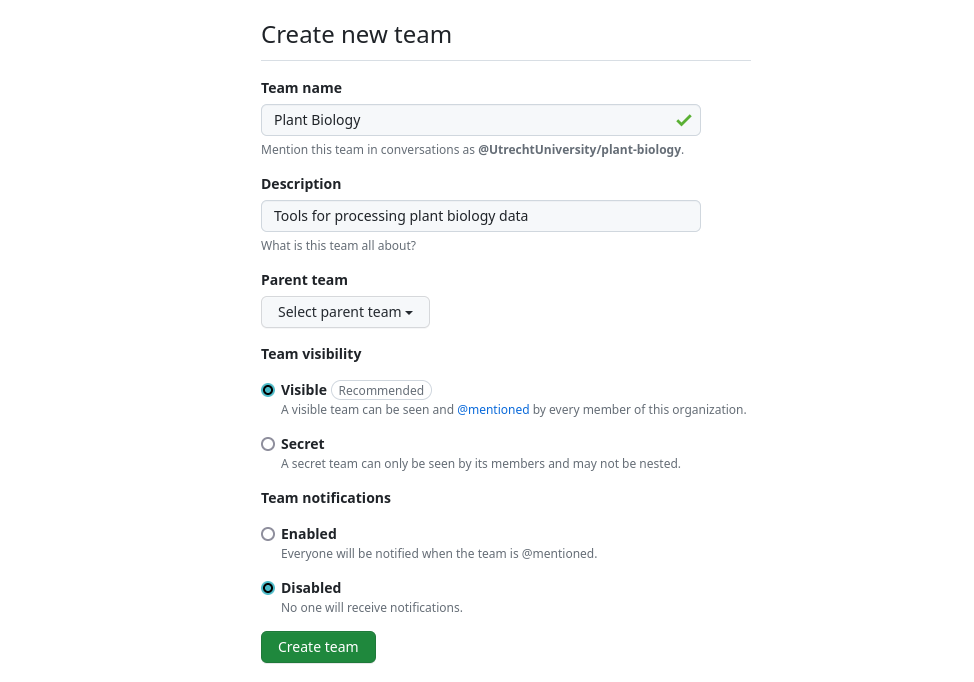
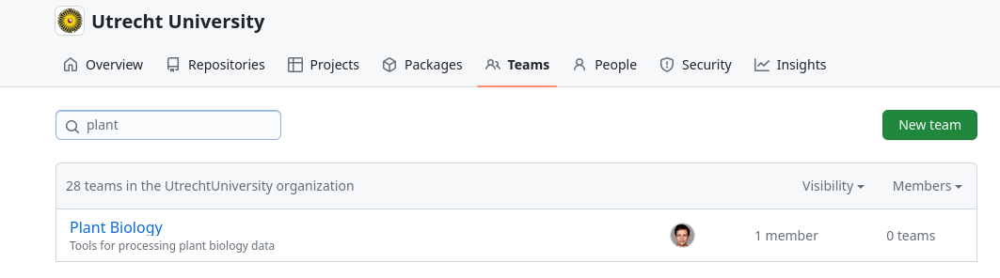
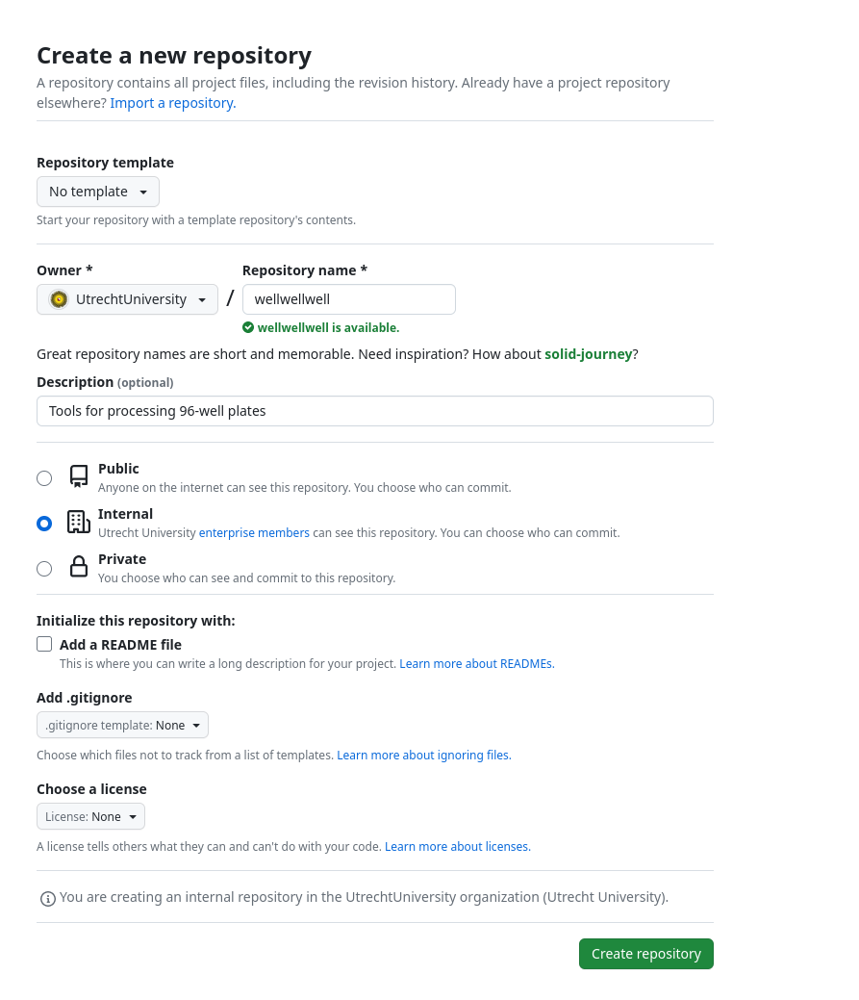
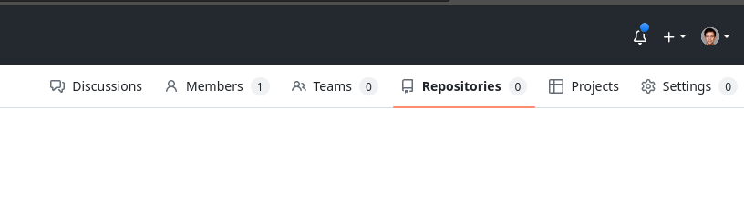
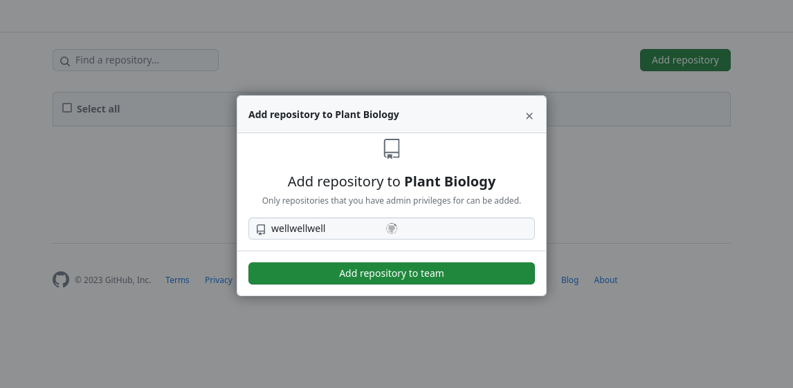
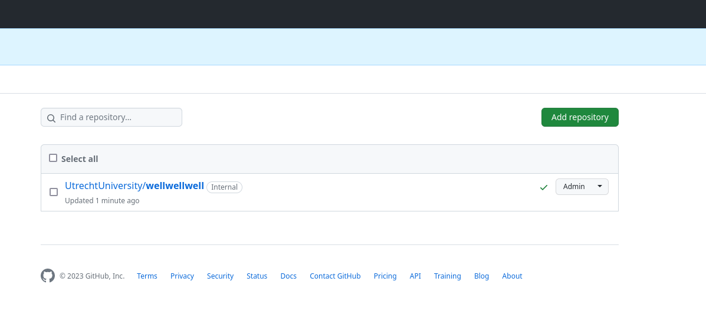
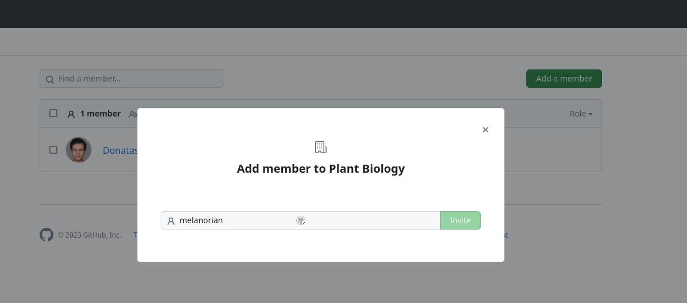

## Creating a team

- Go to https://github.com/UtrechtUniversity
- Log in with your solis ID
- Click on the teams tab
- Click on 'New Team'
- Fill in the fields and confirm the creation

All the settings can be managed later on. It is advised to keep all the defaults. 

 

If you want to go to your team, you can now visit https://github.com/UtrechtUniversity/teams and in the search bar find your team. 

 

## Adding a repository to your team

Before adding a repository to your team, you must create it. To do so, navigate to https://github.com/new and fill in the form. 
For `Owner` select "Utrecht University". In programmer fashion you can choose a name that is a wordplay or pun. You can also deviate from this and choose a name that best describes your project in 1 word. 

 

Then you can go to your team page and navigate to the repositories tab. 

 

Click on `Add Repository` and fill in the name of the repository that you created before and select it from the dropdown menu. 

   

The repository is now visible in the teams interface. On the right dropdown menu you can manage what permissions the team has for the repository.

 

## Adding members

You can add members from the team members tab. In order to add a member, they must be part of the Utrecht University organization. To become a member, you must follow the instructions outlined here https://github.com/UtrechtUniversity/getting-started

 

## Additional information

- A team can have subteams, but generally speaking it is advised to keep the structure as simple as possible and not to introduce hierarchies where they are not necessary
- Repositories can be completely private from the outside world, but in the interest of open science, they really should not be
- Within a team you can start forum-like discussions. This is a good place to ask if anybody knows how to perform a certain operation as the answer will be perserved and if anyone in the future then ends up needing the same information it can be searched for and found
- For questions and problems related directly to a repository, it is best ot make an issue on the repository level, not the team level