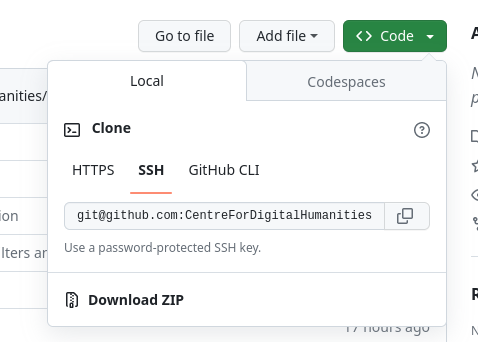

# Web Interface
GitHub offers tools for both version control and project management. This document describes the screens and options you will encounter on their web interface and what they are used for. The document goes through the most frequently used pages. 

Before diving into the various pages, it is good to know some of the terminology and how it may apply to you. 

- **Repository**: a repository is like a digital workspace where people can work together on a project and store their files in a centralized location. While GitHub is largely associated with code, it is good to note that it works for any type of file; you could for instance store your files for a publication there too. It has three levels of visibility:
  - *Private*: Only you and whoever you invite can see the files
  - *Internal*: Only your team and whoever you invite can see the files
  - *Public*: Anyone can see the files
- **Pull Request**: Whenever you make significant changes to a repository, it is common to start the process of a *pull request*. In essence you are giving people the opportunity to review your work before **actually** adding it.
- **Issue**: An issue can be seen as a to-do item. Examples of issues:
  - *Write the discussion section*
  - *Write code for data pipeline*
  - *Extend results section with new research data* 
- **Project**: A project is a way to organize your work in github accross different repositories, it however does not have any code or files associated to it directly. You can think of it as a shared to-do list with colleagues in which you can refer to repositories. 
- **Commit**: A commit can be seen as a (logical) piece of work with a message. The message describes the work you did and generally the aim is to have commits be quite small. Examples of good commits:
  - *Change the colors in a figure*
  - *Add a legend to a figure*
  - *Add chapter to a manuscript*

Welcome Page (github.com)

Within the welcome page there are 3 areas to take note of: 
- The navigation at the top
- The quick access area on the left
- The news feed in the middle

### Navigation

On the left there is a search bar where you can search for repositories, people, teams, and more. Generally speaking you use this to quickly move to a project you are working on. For more elaborate searching, you can use *[Github Search](https://github.com/search)*.

In the middle of the navigation you can navigate to various GitHub products. In practice you will rarely use this. 

On the right side of the navigation you can navigate to your profile and view your notifications. 

### Quick Access

In the quick access section you can quickly get an overview of "places" that you personally frequent often. It can be especially practical if you work on only a few projects at any given time. 

 

### News Feed

The News Feed is a customizable area that displays recent activity. In this case it shows the latest developments of the `aichat` software, however in the `filter` button you can customize it to suit your preferences. The right column is subdivided in the latest changes to GitHub and repositories that the GitHub algorithm thinks are interesting for you. 

 

Your Profile (github.com/{username})

Your profile is a representation of your activity to the outside world. Your profile is viewable to the outside world. Your "contributions" are visualized in the iconic GitHub commit graph. 

UU Organization (github.com/UtrechtUniversity)

The Utrecht University Organization page functions much like the profile page for the entire university. The page provides useful instructions on how to join the Utrecht University organization so you can share you work under this organization. 

### Navigation

You can easily navigate to all the repositories, projects, people, and teams of the university through the navigation menu at the top.

 

### Repositories

If you navigate to the repositories tab you can see all the repositories that are associated with the university. You can filter them, and you can also start new repository directly under the organization by clicking on the `new repository` button.

 

### Teams

Under the teams tab you can find the existing UU teams and you can also start your own. Generally speaking it is good practice to not overcomplicate hierarchies for these teams. You can start a team with whatever people make sense in your context. Avoid creating too many teams.

 

### A University Team

If you navigate to a team page you can view the repositories belonging to a team, the people that are part of it, and any other information the team decides to pu up. Additionally you can use GitHub discussions to have forum-like interactions with the team and its members.

 

Repository (github.com/{username}/{repository}

In the repository you will find the tracked files, an overview of issues related to a project, pull requests, and information about a project.

### Code Browser

If you click on any of the files, you will enter a code browsing mode. From here you can easily browse through all the files in the repository. 

 

### History

If you click on the clock icon that has the text `N commits` next to it, you will be taken to an overview of all the changes that have happened in the project. Clicking on one of these changes will show you exactly work has been done and who authored it. The commit messages can be inidicative of the "why" behind certain work and can serve as a way of providing documentation on the choices within the project. 

 

### Cloning

To clone the code to your laptop, you can click the `code` button. You can then either use the command line interface to get the code or download it in a zipfile format. If you wish to contirbute to a project, it is recommended to us the command line or a tool like GitHub Desktop. If you just want to run the code or get the files, downloading it as a zip is fine. 

 

### Issues

If you click on the issues tab, you will be directed to the issues associated with the project. The issues can have tags that you can dfine yourself. You can filter issues within a project that are assigned to you. You might for instance be an informatician in an interdisciplinary group of people writing a publication; you could then filter out all the issues that are not relevant to you. 

 

Within an issue you can have discussions with colleagues or external actors. For example you could have an issue like *The boxplot of experiment X is not clear* and then have an asynchronous discussion with peers and supervisors on how best to clarify it. You can also describe the exact work that needs to be done to achieve the desired result. 

 

### Pull Requests

In the pull requests tab you have an overview of all the pull requests that are open (or filter by those that have been closed or rejected). From here you can see work that your peers want reviewed. 

 

By clicking on a pull request you can start a review. From this interface you can add comments, suggestions, and questions to the work. If you are content with the work, you can choose to "merge" it into the main branch.

 

